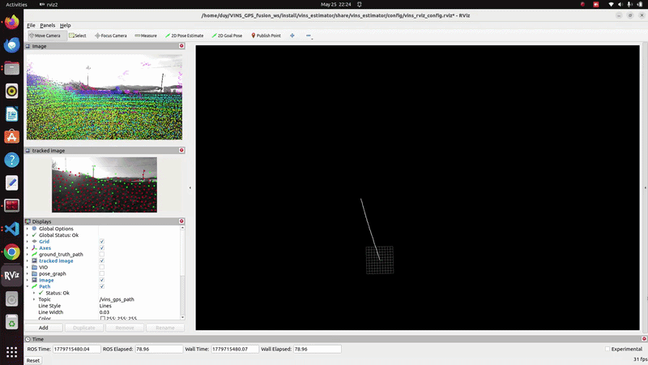

<p align="center">
  
</p>

# GPS-VIO_FGO_Fusion

ROS2-based GPS and Visual-Inertial Odometry (VIO) fusion framework using Factor Graph Optimization (FGO) for robust and accurate localization.  
This package is built upon VINS-Mono and supports optional 3D LiDAR depth integration.

## System Requirements

- Ubuntu 22.04
- ROS2 Humble

---

# Dependencies

Install GTSAM and RViz Satellite:

```bash
# Add GTSAM-PPA
sudo add-apt-repository ppa:borglab/gtsam-release-4.1

sudo apt install libgtsam-dev libgtsam-unstable-dev

sudo apt install ros-humble-rviz-satellite
```

---

# Build GPS-VIO_FGO_Fusion

Clone the repository and build:

```bash
cd ~/gps_vio_fusion_ws/src

git clone https://github.com/HoangHungIRL/GPS-VIO_FGO_Fusion.git

cd ..

colcon build

source install/setup.bash
```

---

# Run GPS-VIO_FGO_Fusion

Launch:

```bash
ros2 launch vins_estimator AGRI.launch.py
```

Play dataset:

```bash
ros2 bag play YOUR_PATH_TO_DATASET
```

---

# Notes

To convert ROS1 bags to ROS2 bags, install the `rosbags` package:

```bash
pip install rosbags

echo "export PATH=\"~/.local/bin:\$PATH\"" >> ~/.bashrc

source ~/.bashrc
```

Convert ROS1 bag:

```bash
rosbags-convert foo.bag
```

---

# Features

- GPS and VIO fusion using Factor Graph Optimization (FGO)
- Built upon VINS-Mono
- ROS2 Humble support
- Optional 3D LiDAR depth integration
- Real-time localization framework
- Modular multi-sensor fusion architecture

---

# Acknowledgement

This project is built upon the excellent VINS-Mono framework.
